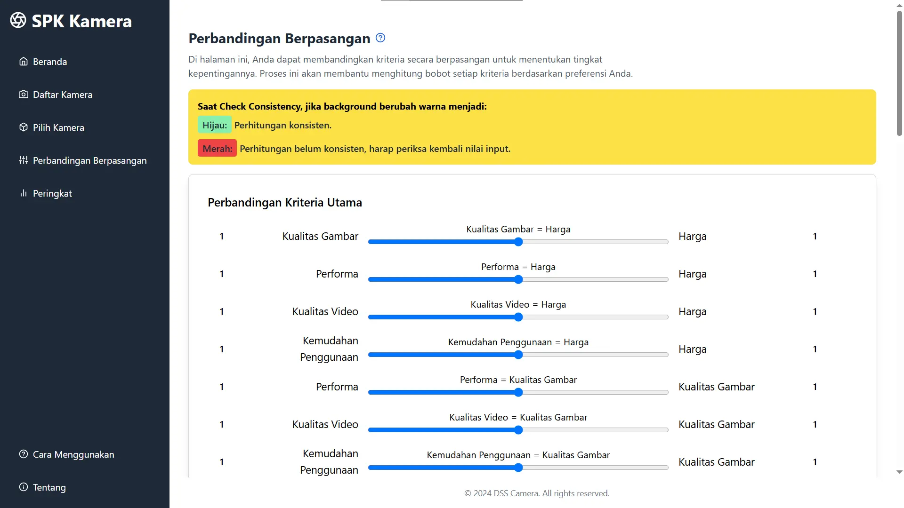
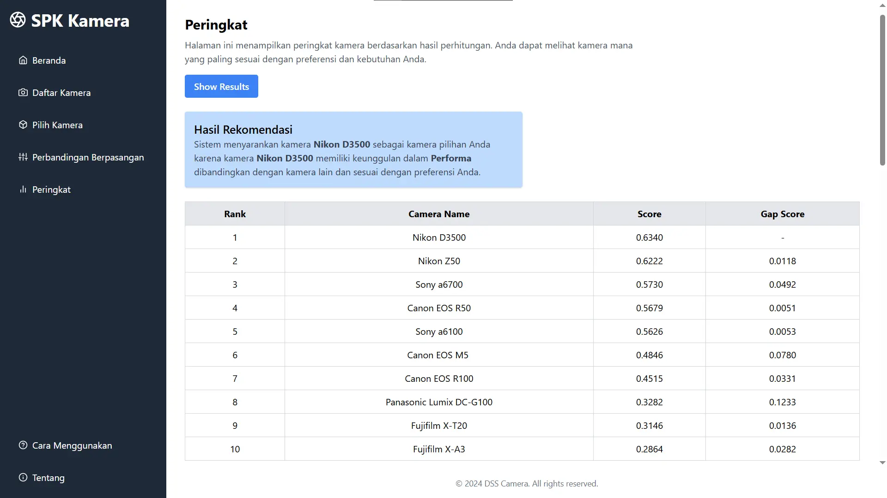
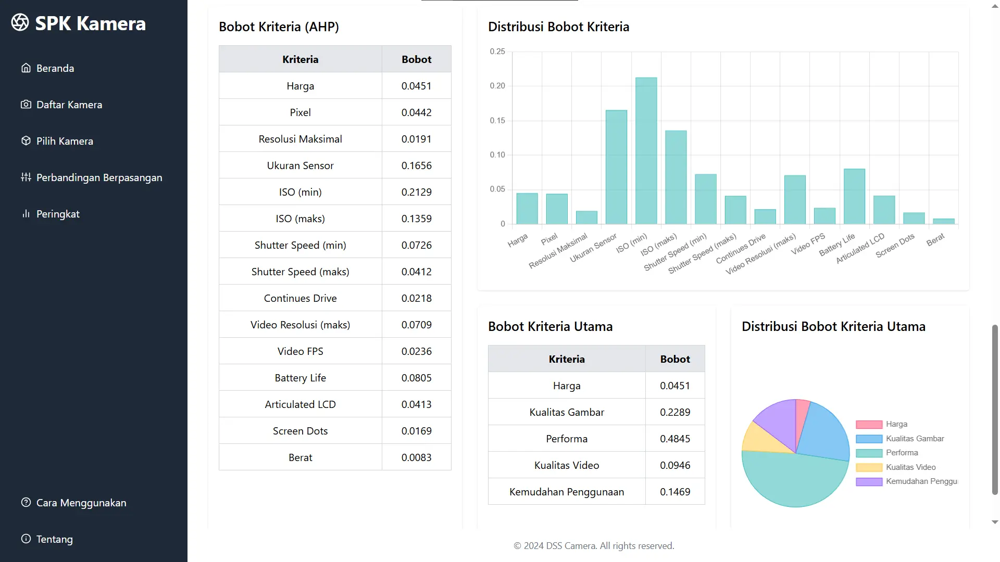

Read this in other language: [Bahasa Indonesia](README-ID.md)

Backend repository: [Backend](https://github.com/petrabayu/dss-camera-backend)

# Decision Support System for Digital Camera Selection (Frontend)

## **Description**

A web-based Decision Support System application designed to assist users in selecting the most suitable digital camera based on multiple criteria such as image quality, performance, price, video quality, and ease of use. The application leverages the Analytical Hierarchy Process (AHP) method for criteria weighting and Technique for Order Preference by Similarity to Ideal Solution (TOPSIS) method for final ranking.

## **Screenshot**







## **Feature**

- CRUD Digital Cameras,
- Pairwise Comparison using AHP method,
- Ranking best camera by preference using TOPSIS method.

## **Tech Stack**

- **Frontend:** React Vite, Tailwind, Axios, ChartJs,
- **Backend:** NodeJS, ExpressJS,
- **Database:** MySQL.

## **Installation**

1. Make sure you have cloned and run the backend program first: [DSS-Backend](https://github.com/petrabayu/dss-camera-backend),
2. Backend server runs on http://localhost:3000 by default,
   > **NOTE:** If you prefer using a different port, feel free to update the backend port and adjust the corresponding API endpoint on the frontend as well.
3. Next, clone and run the frontend by following instruction below:

```bash
git clone https://github.com/petrabayu/dss-camera-frontend.git

cd dss-camera-frontend

npm install

npm run dev
```

4. Program will run on `http://localhost:5173/` by default.

## **Contact**

**Created by petrabayu - [LinkedIn](https://www.linkedin.com/in/petrabayu/) - petrabayu19@gmail.com**
